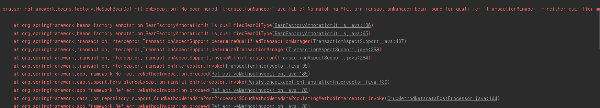

# @EnableTransactionManagement

### 1. @EnableTransactionManagement란?
 Spring의 Annotation 기반의 트랜잭션 관리 기능을 사용할 때 쓰인다. 
 xml 기반의 **tx:annotation-driven'**과 유사한 기능이다.

proxy, aspectJ, aop동작기반 등을 지원하여 @Transactional을 선언한 곳에서 이러한 기능들을 지원해준다.

@EnableTransactionManagement 소스
~~~java 
@Target({ElementType.TYPE})
@Retention(RetentionPolicy.RUNTIME)
@Documented
@Import({TransactionManagementConfigurationSelector.class})
public @interface EnableTransactionManagement {
    boolean proxyTargetClass() default false;

    AdviceMode mode() default AdviceMode.PROXY;

    int order() default 2147483647;
}
~~~

### 2. tx:annotation-driven기반과의 차이점
tx:annotation은 default로 bean 이름이 transactionManager를 찾도록 되어있다. 반면에 @EnableTransactionManagement는 이런 default bean 이름과 상관없이 사용자가 설정한 name에 따라 설정이 가능하다. 

### 3. 설정

~~~java
@Configuration
@EnableJpaRepositories(basePackageClasses = MemberManagementJpaRepo.class)
@EnableTransactionManagement
@PropertySource("classpath:jpa.properties")
public class JpaConfig implements PersistenceConfig{
    
    @Autowired
    private Environment env;

    @Bean
    public LocalContainerEntityManagerFactoryBean entityManagerFactory(DataSource dataSource) {
        LocalContainerEntityManagerFactoryBean emf = new LocalContainerEntityManagerFactoryBean();
        emf.setJpaVendorAdapter(jpaVendorAdapter());
        emf.setDataSource(dataSource);
        emf.setPersistenceUnitName("persistenceJpa");
        emf.setPackagesToScan("com.domain.*");
        emf.setJpaProperties(additionalProperties());
        return emf;
    }

    private JpaVendorAdapter jpaVendorAdapter(){
        HibernateJpaVendorAdapter jpaVendorAdapter = new HibernateJpaVendorAdapter();
        jpaVendorAdapter.setShowSql(true);
        return jpaVendorAdapter;
    }

    @Bean
    public PlatformTransactionManager jpaTransactionManager(EntityManagerFactory entityManagerFactory) {
        JpaTransactionManager jpaTransactionManager = new JpaTransactionManager();
        jpaTransactionManager.setEntityManagerFactory(entityManagerFactory);
        return jpaTransactionManager;
    }

    private Properties additionalProperties() {
        Properties properties = new Properties();
        properties.setProperty("spring.jpa.hibernate.ddl-auto", env.getProperty("ddl-auto"));
        properties.setProperty("spring.jpa.show-sql", env.getProperty("show-sql"));
        properties.setProperty("spring.jpa.properties.hibernate.format_sql",  env.getProperty("format_sql"));
        return properties;
    }
~~~
~~~JAVA
public interface MemberManagementJpaRepo extends JpaRepository<Member, Long>{

}
~~~
 
 위의 내용을 실행하면 테스트가 실패한다. 스택 트레이스를 확인해보면 

**"transactionManager"**의 Bean을 찾을 수 없다는 내용이다. 

위의 xml기반의 태그와의 차이점은 분명하게 bean 이름을 유연하게 설정 할 수 있다는 내용이었는데, 왜 여기서도 transactionManager라는 bean을 찾고있는지 의아했다. 

### 3. 문제 확인 및 분석..

먼저 문제를 확인하기 위하여 두 개의 상황을 테스트해보고 결과를 확인해봤다.
 
 1번, transactionManager bean이름을 transactionManger로 변경 => 성공
 
 2번, jpa가 아닌 jdbcTemplate으로 설정하였을 때 결과값  => 성공

 둘다 성공으로 나왔다. 그렇다면, Jpa설정에서 무언가가 default bean 이름을 transactionManager로 설정하는 부분이 있다는 것인데, 인터넷에 막 뒤져보니 문제의 주요 원인은 Spring Data Jpa를 활성화하기 위해 설정한 **@EnableJpaRepositories** 어노테이션이다. 

해당 어노테이션에 들어가보면 

~~~JAVA

@Target({ElementType.TYPE})
@Retention(RetentionPolicy.RUNTIME)
@Documented
@Inherited
@Import({JpaRepositoriesRegistrar.class})
public @interface EnableJpaRepositories {
        //생략 ...
    String transactionManagerRef() default "transactionManager";

}
~~~
이 부분이 있었다....
생각해보면 Spring Data Jpa가 제공하는 클래스에서 transaction만 쏙 빼고 지원할일이 없었을것이다.  default로 transaction을 지원하는데 그 이름이 transactionManager였던거다.

나는  Spring Data Jpa를 사용했던거였고, 만약 내가 직접 @Repository를 명시한 클래스를 만들었으면, @EnableRepositories 어노테이션은 필요가 없고 transactional을 설정한 bean이름을 제대로 찾아 오류가 안났을 거다.
(테스트를 했던 JdbcTemplate처럼)

그래서 만약 내가 원하는 bean이름을 지정하고 싶을 경우에는 

~~~JAVA
@EnableJpaRepositories(
        basePackageClasses = MemberManagementJpaRepo.class,
        transactionManagerRef = "jpaTransactionManager")

~~~

이렇게 바꿔줘야한다. 그러면 Spring Data Jpa에서 기본으로 제공하는 transactional에 대한 bean의 참조값을 바꿔줘야 정상작동한다. 

