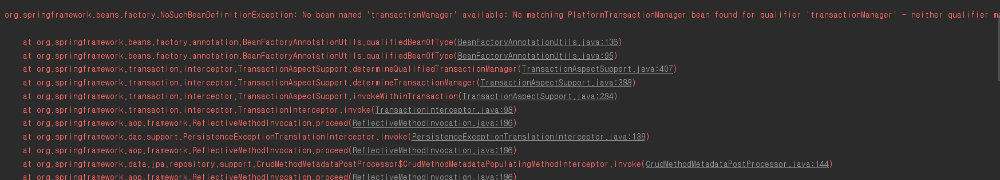

# @EnableTransactionManagement

### 1. @EnableTransactionManagement란?
 Spring의 Annotation 기반의 트랜잭션 관리 기능을 사용할 때 쓰인다. 일명 @Transactional 어노테이션 타입의 선언적(?) 트랜잭션을 위한 용도로 사용된다. 

또한 기본적으로 Proxy와 AspectJ를 지원한다. 

@EnableTransactionManagement 소스
~~~java 
@Target({ElementType.TYPE})
@Retention(RetentionPolicy.RUNTIME)
@Documented
@Import({TransactionManagementConfigurationSelector.class})
public @interface EnableTransactionManagement {
    boolean proxyTargetClass() default false;

    AdviceMode mode() default AdviceMode.PROXY;

    int order() default 2147483647;
}
~~~

### 2. 설정

~~~java
@Configuration
@EnableJpaRepositories(basePackageClasses = MemberManagementJpaRepo.class)
@EnableTransactionManagement
@PropertySource("classpath:jpa.properties")
public class JpaConfig  {
    
    @Autowired
    private Environment env;

    @Bean
    public LocalContainerEntityManagerFactoryBean entityManagerFactory(DataSource dataSource) {
        LocalContainerEntityManagerFactoryBean emf = new LocalContainerEntityManagerFactoryBean();
        emf.setJpaVendorAdapter(jpaVendorAdapter());
        emf.setDataSource(dataSource);
        emf.setPersistenceUnitName("persistenceJpa");
        emf.setPackagesToScan("com.domain.*");
        emf.setJpaProperties(additionalProperties());
        return emf;
    }

    private JpaVendorAdapter jpaVendorAdapter(){
        HibernateJpaVendorAdapter jpaVendorAdapter = new HibernateJpaVendorAdapter();
        jpaVendorAdapter.setShowSql(true);
        return jpaVendorAdapter;
    }

    @Bean
    public PlatformTransactionManager transactionManager(EntityManagerFactory entityManagerFactory) {
        JpaTransactionManager jpaTransactionManager = new JpaTransactionManager();
        jpaTransactionManager.setEntityManagerFactory(entityManagerFactory);
        return jpaTransactionManager;
    }

    private Properties additionalProperties() {
        Properties properties = new Properties();
        properties.setProperty("spring.jpa.hibernate.ddl-auto", env.getProperty("ddl-auto"));
        properties.setProperty("spring.jpa.show-sql", env.getProperty("show-sql"));
        properties.setProperty("spring.jpa.properties.hibernate.format_sql",  env.getProperty("format_sql"));
        return properties;
    }

~~~
~~~java
@Service
@Transactional
public class MemberManagementImpl implements MemberManagementService {
        //생략....
}

~~~
 

### 3. 주의사항

default로 **"transactionManager"** 라는 Bean 이름을 찾는다. 그래서 위에서 설정코드는 정상작동하지만, 아래에서처럼 다른 bean 메소드를 설정하면, 
transactionManager라는 Bean을 찾을 수 없다는 오류가 발생한다.

~~~ java 
    @Bean
    public PlatformTransactionManager jpaTransactionManager(EntityManagerFactory entityManagerFactory) {
        JpaTransactionManager jpaTransactionManager = new JpaTransactionManager();
        jpaTransactionManager.setEntityManagerFactory(entityManagerFactory);
        return jpaTransactionManager;
    }
~~~

단일 트랜잭션 메니저를 사용할 경우 transactionManager라는 이름을 사용하느게 좋으나, 
다중 트랜잭션 매니저를 설정할 경우에는 별도의 설정이 필요할 듯 싶다. 