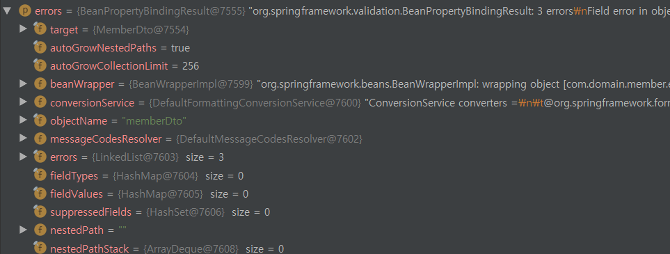

# Errors 객체 ResponseBody에 담기

스터디에서 진행하는 프로젝트 연습 중에 Validation 체크 후 error 객체를 
Response Body에 담아 보낼려고 하였다.

인프런에서 백기선님의 RestAPI 강의부분에서 잠깐 다룬 내용이지만, 완전히 따라하는 것보다는 
고민해보고 일부분만이라도 직접 구현해보기로 하였다. 

### 1. 상황

validation체크는 총 3가지로 이루어져있다. 

- 1번, email 중복체크
- 2번, 핸드폰 중복체크
- 3번, 패스워드 일치여부 체크

[ Controller 클래스 ]
~~~JAVA
@Controller
@RequiredArgsConstructor
@RequestMapping(produces = MediaType.APPLICATION_JSON_UTF8_VALUE)
public class MemberController {

    private final MemberValidatior memberValidatior;
    private final MemberCommonRepository memberCommonRepository;
    private final ModelMapper modelMapper;

 @PostMapping("/api/member")
    public ResponseEntity addMember(@RequestBody MemberDto memberDto, Errors errors)  {

        memberValidatior.validate(memberDto, errors);
        if(errors.hasErrors()){
            ResponseErrors responseErrors = new ResponseErrors(errors);
            return ResponseEntity.badRequest().body(JsonMappingUtils.toJson(responseErrors.getResponseErrorsList()));
        }

        Member member = modelMapper.map(memberDto, Member.class);
        Member result = memberCommonRepository.save(member);

        return ResponseEntity.ok(result);
    }
~~~
[ MemberValidator 클래스 ]
~~~JAVA
@Component
public class MemberValidatior {

    private final MemberCommonRepository memberCommonRepository;

    public MemberValidatior(MemberCommonRepository memberCommonRepository){
        this.memberCommonRepository = memberCommonRepository;
    }

    public void validate(MemberDto memberDto, Errors errors) {
        Optional<Member> validationEmail = memberCommonRepository.findMemberByMemberEmail(memberDto.getMemberEmail());
        Optional<Member> validationPhoneNumber = memberCommonRepository.findMemberByMemberEmail(memberDto.getMemberEmail());

        if(!validationEmail.isEmpty()){
            errors.rejectValue("memberEmail","duplicateEmail","다른사람과 중복된 email입니다. 다른 email을 선택해주세요");
        }
        if(!memberDto.getMemberPassword().equals(memberDto.getMemberCheckPassword())){
            errors.rejectValue("memberPassword", "InconsistencyPassword", "패스워드가 일치하지 않습니다.");
        }

        if(!validationPhoneNumber.isEmpty()){
            errors.rejectValue("memberPhoneNumber", "duplicatePhonNumber", "다른 사람이 사용하는 번호입니다. 다른 번호를 입력해주세요");
        }
    }
}
~~~

validator클래에서 MemberDto에 대한 유효성 검사를 하여, 유효성 검사가 실패할 경우 **Errors**의 fieldError로 담고 있다. 

그런데 여기서 문제는 HTTP Body에 응답값으로 바꾸려면 Json 객체로 돌려줘야한다. Errors객체 정보를 디버깅 모드로 확인해보면,

위의 그림과 같이 rejectValue로 넣은 값만 있는게 아니라, 다른 정보들도 많이 들어가 있다. 그래서 이 Errors 객체를 그대로 json 직렬화를 수행하면 Java Bean 규약에 맞지 않아 직렬화 오류가 발생한다. 

그렇다면 내가 원하는 정보만 Java Bean 규약에 맞게 객체화하여 직렬화하면 Http Body값에 에러에 대한 정보를 넘겨줄 수 있다. 

### 2. Errors 객체 Java Bean 규격에 맞게 설정

어떻게 만들까 고민하다가 "기억보다 기억을"이라는 유명한 블로그에서 일급컬렉션에 대한 글을 최근에 봤었는데, 이 내용을 참고하여 Errors 객체를 재가공하여 만들어봤다.(정말 많은 도움이 됬다.)
(그렇다고 내가 만든건 일급컬렉션은 아닌 것 같다. 아직 지식이 부족하여 일급컬렉션에 대한 내용도 완전 이해는 못하고 있는 것 같다.)

~~~JAVA

@Getter @Setter
@ToString
public class ResponseErrors  {

    private List<ErrorInformation> responseErrorsList = new ArrayList<>();

    public ResponseErrors(Errors result){
        this.setErrorsToList(result);
    }

    private void setErrorsToList(Errors result){
        for(FieldError fieldError : result.getFieldErrors()){
            ErrorInformation errorInformaation = new ErrorInformation();
            errorInformaation.setErrorName(fieldError.getField());
            errorInformaation.setMessage(fieldError.getDefaultMessage());
            responseErrorsList.add(errorInformaation);
        }
    }

    @Setter @Getter
    private class ErrorInformation{
        private String errorName;
        private String message;
    }

}
~~~

List를 불변성있는 필드로 만들기 위하여 private Inner클래스로 랩핑하여, 외부에서 ResponseErrors를 조작할 수 없도록 하였다. 

처음에는 ResponseErrors 클래스에 errorName과 message 필드를 둘까 고민을 하였다. 그렇게 되면, ResponseErrors를 사용하는 여러 외부클래스에 List에 대한 비즈니스로직이 중복으로 사용하게 되는 문제점을 낳을 수 있었다. ResponseErrors에 List에 대한 비즈니스 로직을 집중시키고, 외부클래스에서는 responseErrorsList라는 필드만 Get하여 사용하기만 하면된다. 

JsonUtil파일을 만들어서 해당 error List를 json 직렬화하여 body에 응답값이 전달 가능해진다. 

